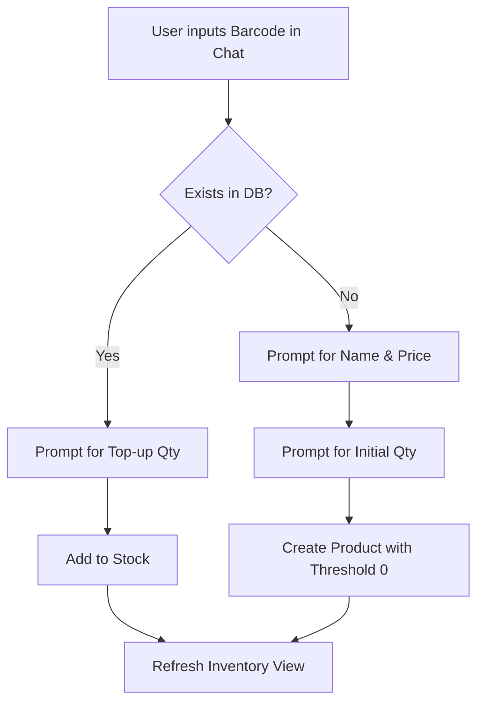
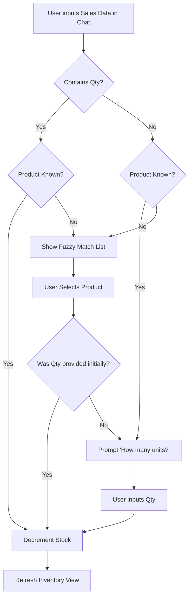

# MaMarket Stock — Functional Specification

**Version:** 1.1 (Parent Version: 1.0)
**Changelog:**
* R1: Added Product Deletion.
* R2: Replaced CSV/Excel sales upload with Chat-Based Sales Entry.
* R3: Added Unrecognised Product Fuzzy Match.
* R4: Removed all file upload features for sales data.

## 1. Functional Modules

The system is divided into two core functional modules:
*   **MOD-CAT (Catalogue Management):** Handles the conversational interface for creating new products, manually topping up stock, and deleting products.
*   **MOD-INV (Inventory Management):** Manages the core inventory ledger, processes chat-based sales entry, calculates low-stock alerts, and provides the real-time tabular view.

## 2. Logical Data Model

*   **Product:**
    *   `Barcode` (String, Primary Key): Unique identifier.
    *   `Name` (String): Product description.
    *   `Price` (Numeric): Unit price.
    *   `Quantity` (Integer): Current stock level (can be negative).
    *   `Threshold` (Integer): Reorder alert level (default 0).

## 3. Data Flows & Process Diagrams

### 3.1 Chat Entry Flow (Creation & Top-up)

### 3.2 Chat-Based Sales Entry Flow

## 4. Function Specifications

### 4.1 Create Product (Chat)
*   **Purpose:** Allow users to onboard new products quickly via a chat interface.
*   **FR Implemented:** FR-001
*   **Preconditions:** Barcode does not exist.
*   **Input Spec:** Name (string), Price (numeric), Barcode (string).
*   **Processing Logic:** Validate inputs. Prompt for initial quantity. Set default threshold to 0. Insert into `Product` table.
*   **Postconditions:** Product is saved; Inventory View is refreshed.
*   **Error Scenarios:** If barcode exists, abort creation and suggest top-up.

### 4.2 Top-up Stock (Chat)
*   **Purpose:** Allow users to manually add stock to an existing product.
*   **FR Implemented:** FR-002
*   **Preconditions:** Barcode exists.
*   **Input Spec:** Barcode (string), Quantity (integer > 0).
*   **Processing Logic:** Find product. Add input quantity to current `Quantity`.
*   **Postconditions:** Stock is incremented; Inventory View is refreshed.
*   **Error Scenarios:** Invalid quantity format.

### 4.3 Chat-Based Sales Entry
*   **Purpose:** Record sales quickly via chat, supporting multiple formats (barcode, name, batch).
*   **FR Implemented:** FR-008, FR-009
*   **Preconditions:** None.
*   **Input Spec:** Chat string (e.g., 'Cola 5', '1234567890', 'Cola 5, Fanta 3').
*   **Processing Logic:** Parse input. If product unrecognised, trigger fuzzy match. If quantity missing, prompt for it. Once product and quantity are known, decrement `Quantity` in DB.
*   **Postconditions:** Stock levels updated; Inventory View is refreshed.
*   **Error Scenarios:** Invalid quantity format triggers error prompt. No fuzzy match found aborts entry.

### 4.4 View Inventory & Alerts
*   **Purpose:** Provide real-time visibility and low-stock signals.
*   **FR Implemented:** FR-005
*   **Preconditions:** None.
*   **Processing Logic:** Fetch all `Product` records. If `Quantity` <= `Threshold`, flag row (visual badge).
*   **Postconditions:** Data displayed to user.

### 4.5 Edit Threshold
*   **Purpose:** Allow Admin to adjust reorder sensitivity.
*   **FR Implemented:** FR-006
*   **Preconditions:** User is Admin.
*   **Input Spec:** New threshold (integer).
*   **Processing Logic:** Update `Threshold` for the selected `Product`. Recalculate alert status.
*   **Postconditions:** DB updated; UI reflects new alert status.

### 4.6 Delete Product
*   **Purpose:** Allow Admin to permanently remove a product from the catalogue.
*   **FR Implemented:** FR-010
*   **Preconditions:** User is Admin. Product exists.
*   **Input Spec:** Confirmation click on the delete dialog.
*   **Processing Logic:** Delete the selected `Product` record from the database.
*   **Postconditions:** DB updated; UI removes the product row.
*   **Error Scenarios:** DB lock/failure displays an error.

## 5. User Stories (US)

*   **US-01:** As a Staff member, I want to add a new product via chat so that I don't have to navigate complex forms.
    *   *Given* I enter a new barcode in the chat
    *   *When* I provide the name, price, and initial quantity
    *   *Then* the system creates the product and shows it in the inventory.
*   **US-02:** As a Staff member, I want to scan an existing barcode in the chat to quickly add new stock.
    *   *Given* I scan an existing barcode
    *   *When* I enter the top-up quantity
    *   *Then* the system adds it to the current stock.
*   **US-08:** As a Staff member, I want to record sales by typing the product name or barcode in the chat so that I don't need to use complex forms.
    *   *Given* I enter a product identifier in the chat
    *   *When* I submit it
    *   *Then* the system decrements the stock or asks for the quantity if omitted.
*   **US-09:** As a Staff member, I want the system to suggest similar products if I misspell a name so that I can quickly correct my entry.
    *   *Given* I type an unrecognised product name
    *   *When* I submit it
    *   *Then* the system shows a list of fuzzy matches to select from.
*   **US-05:** As a Staff member, I want to see a visual alert on products that are low on stock so that I know what needs reordering.
    *   *Given* a product's quantity drops to or below its threshold
    *   *When* I view the inventory
    *   *Then* the product row displays a clear visual warning badge.
*   **US-06:** As an Administrator, I want to edit the reorder threshold directly in the inventory table so that I can quickly adjust alerting rules.
    *   *Given* I am viewing the inventory
    *   *When* I click and change the threshold number for a product
    *   *Then* the system saves the new threshold and immediately updates the alert status.
*   **US-10:** As an Administrator, I want to delete a product from the inventory table so that I can remove obsolete items.
    *   *Given* I click the delete button on a product row
    *   *When* I confirm the deletion
    *   *Then* the system permanently removes the product from the catalogue.

## 6. Acceptance Criteria

*   **AC-001:** (US-01, FR-001) Given the user enters a new barcode in the chat, when they provide the name, price, and initial quantity, then the system creates the product and shows it in the inventory with the specified initial quantity.
*   **AC-002:** (US-01, FR-001) Given the user enters an existing barcode in the chat, when they attempt to create a new product, then the system blocks the entry and displays an error message suggesting the top-up flow.
*   **AC-003:** (US-02, FR-002) Given the user scans an existing barcode, when they enter a valid top-up quantity, then the system adds it to the current stock and updates the inventory view immediately.
*   **AC-004:** (US-02, FR-002) Given the user scans an existing barcode, when they enter an invalid quantity format, then the system shows an error prompt and does not update the stock.
*   **AC-013:** (US-08, FR-008) Given the user enters a barcode or name without quantity, when submitted, then the system prompts "How many units sold?" and awaits quantity input.
*   **AC-014:** (US-08, FR-008) Given the user enters a product and quantity together (e.g., 'Cola 5' or '1234567890 5'), when submitted, then the system immediately decrements the stock without further prompts.
*   **AC-015:** (US-08, FR-008) Given the user enters a comma-separated batch of products and quantities, when submitted, then the system processes all items in one go and decrements their stock.
*   **AC-016:** (US-09, FR-009) Given the user enters an unrecognised product name, when submitted, then the system displays a list of fuzzy matches and waits for the user to select the correct product.
*   **AC-017:** (US-10, FR-010) Given the Admin clicks the delete button and confirms, when processed, then the system permanently removes the product from the database and UI.
*   **AC-009:** (US-05, FR-005) Given a product's quantity drops to or below its threshold, when the inventory is viewed, then the product row displays a clear visual warning badge.
*   **AC-010:** (US-06, FR-006) Given the Administrator is viewing the inventory, when they click and change the threshold number for a product to a valid integer, then the system saves the new threshold and immediately updates the alert status.
*   **AC-011:** (US-06, FR-006) Given the Administrator is viewing the inventory, when they enter a non-integer threshold, then the system rejects the input with an inline error tooltip.

## 7. Traceability Matrix

| Business Obj | FR ID | Module | Function | User Story | Acceptance Criteria |
| :--- | :--- | :--- | :--- | :--- | :--- |
| B-001 | FR-001 | MOD-CAT | 4.1 Create Product | US-01 | AC-001, AC-002 |
| B-001 | FR-002 | MOD-CAT | 4.2 Top-up Stock | US-02 | AC-003, AC-004 |
| B-001 | FR-010 | MOD-CAT | 4.6 Delete Product | US-10 | AC-017 |
| B-002 | FR-008 | MOD-INV | 4.3 Chat-Based Sales Entry | US-08 | AC-013, AC-014, AC-015 |
| B-002 | FR-009 | MOD-INV | 4.3 Chat-Based Sales Entry | US-09 | AC-016 |
| B-003 | FR-005 | MOD-INV | 4.4 View Inventory | US-05 | AC-009 |
| B-003 | FR-006 | MOD-INV | 4.5 Edit Threshold | US-06 | AC-010, AC-011 |
